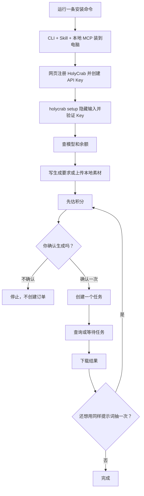

# HolyCrab CLI 使用指南

这份指南只做一件事：让你从一台普通 Mac 或 Linux 电脑出发，装好 HolyCrab CLI、Skill 和本地 MCP，然后完成 API Key 配置、估价、生成、查任务和下载。

整套工具直接使用 HolyCrab 现有正式服务，不需要等待新 OAuth 或新 MCP 后端上线。



## 1. 安装

macOS / Linux 推荐安装固定版本：

```bash
curl -fsSL https://raw.githubusercontent.com/AstroxNetwork/skills/v0.2.0/install.sh | sh
```

当前仓库尚未发布时，可以在仓库目录里测试完全相同的安装过程：

```bash
HOLYCRAB_INSTALL_SOURCE_DIR="$PWD" sh install.sh
```

安装器会完成三件事：

1. 安装 `holycrab` 命令。
2. 给 Codex 和 Claude Code 安装 HolyCrab Skill。
3. 检测到 Codex 或 Claude Code 时，登记本地 `holycrab mcp serve`。

它不会要求 sudo，也不会在安装阶段索要 API Key。

如果提示找不到 `holycrab`，先运行：

```bash
export PATH="$HOME/.local/bin:$PATH"
```

然后自检：

```bash
holycrab doctor --json
```

看到 `"ok": true` 就说明本地文件齐了。`"keyConfigured": false` 很正常，因为还没配置 API Key。

## 2. 注册并配置 API Key

1. 打开 [HolyCrab API Key 页面](https://generate.holycrab.ai/user-tokens)。
2. 没有账号就先注册、登录。
3. 创建或复制一个 API Key。建议给这个 Key 设置合理的积分额度。
4. 回到终端运行：

```bash
holycrab setup
```

终端会隐藏你粘贴的内容。CLI 验证成功后，把 Key 保存在本机。也可以用含义更明确的 `holycrab auth set-key` 完成相同操作：

```text
~/.config/holycrab/config.json
```

这个文件只有当前电脑用户可读写。不要把 Key 发到聊天里，也不要写进提示词。

如果终端原来设置过 `HOLYCRAB_API_KEY`，它会优先于刚保存的 Key。CLI 会显示提醒；运行下面这条命令即可切回本地配置：

```bash
unset HOLYCRAB_API_KEY
```

检查 Key 状态和余额：

```bash
holycrab auth status
holycrab credits balance
```

## 3. 看看能生成什么

```bash
holycrab models list
holycrab models show dreamina-seedance-2-5-260628
holycrab models show MiniMax-H3
```

先查再用，不要凭记忆猜时长、清晰度或素材数量。模型更新时，CLI 和 MCP 读取同一份公开能力清单。

## 4. 第一次生成图片

先估积分，不创建任务：

```bash
holycrab generate estimate --kind image \
  --json '{"prompt":"A tiny red crab reading beside a rainy window","model":"seedream-5-0-lite-260128","size":"2k"}'
```

确认模型、尺寸和积分后，运行创建命令：

```bash
holycrab generate create --kind image \
  --json '{"prompt":"A tiny red crab reading beside a rainy window","model":"seedream-5-0-lite-260128","size":"2k"}'
```

CLI 会再显示估算并问：

```text
Create one billable task with this request? [y/N]
```

输入 `y` 才会创建一个付费任务。记下返回的 `taskId`。

自动化脚本可以使用 `--yes`，但只能在用户已经明确确认后使用：

```bash
holycrab generate create --kind image --yes \
  --json '@/absolute/path/image-request.json'
```

## 5. 生成视频或音频

Seedance 2.5 视频估算示例：

```bash
holycrab generate estimate --kind video \
  --json '{"model":"dreamina-seedance-2-5-260628","prompt":"A paper boat crosses a neon puddle","duration":8,"resolution":"720p","ratio":"16:9","videoTaskType":"reference"}'
```

MiniMax H3 视频估算示例：

```bash
holycrab generate estimate --kind video \
  --json '{"model":"MiniMax-H3","prompt":"Morning fog moves through a pine forest","duration":5,"resolution":"768P","ratio":"16:9"}'
```

音频估算示例：

```bash
holycrab generate estimate --kind audio \
  --json '{"textPrompt":"A calm narrator welcomes the listener.","audioConfig":{"format":"mp3","sample_rate":24000}}'
```

把 `estimate` 换成 `create` 后仍会先询问确认。

## 6. 使用本地素材

```bash
holycrab assets upload /absolute/path/reference.mp4 \
  --content-type video/mp4 \
  --duration-seconds 8
```

上传成功后只保留返回的素材 ID。临时上传地址不会显示在终端或 Agent 回复里。

## 7. 查任务、等待和下载

```bash
holycrab tasks list
holycrab tasks get TASK_ID
holycrab tasks wait TASK_ID --timeout 600
holycrab download TASK_ID --output ./result.mp4
```

`step=2` 表示完成，`step=3` 表示失败。等待超时只代表“暂时没等到”，CLI 不会偷偷再生成一次。

## 8. 同样的提示词多抽几次

允许。每次你明确确认，都是一个新订单：

```text
第一次确认 → attempt A → task A
第二次确认 → attempt B → task B
第三次确认 → attempt C → task C
```

本地防重只阻止同一个 attempt 被网络重试两次，不会阻止你主动再抽一次。

## 9. 在 Codex 或 Claude Code 里使用

检查 MCP 是否已经登记：

```bash
codex mcp get holycrab
claude mcp get holycrab
```

然后可以直接对 Agent 说：

```text
用 HolyCrab 查一下现在的视频模型。我要做 8 秒、16:9 的雨夜街景，先给我模型建议和积分估算，不要直接生成。
```

Agent 应该按这个顺序工作：查能力 → 组参数 → 估积分 → 等你确认 → 为这次抽卡创建一个稳定 attempt ID → 提交一次 → 返回任务 ID → 查结果。网络重试必须沿用同一个 ID；你明确再抽一次时才换新 ID。

## 10. 常见问题

`holycrab: command not found`

```bash
export PATH="$HOME/.local/bin:$PATH"
```

Key 验证失败：如果输出显示 `"credentialSource": "environment"`，先运行 `unset HOLYCRAB_API_KEY`，再运行 `holycrab setup`；否则回到网页确认 Key 仍然启用。

网络中断：先运行 `holycrab tasks list` 查看最近任务。不要立刻重复相同 attempt；如果你明确想重新抽一次，再发起一个新创建命令。

清除本机保存的 Key：

```bash
holycrab auth clear-key
```

这只删除本机保存的 Key。需要彻底撤销时，还要去 HolyCrab 网页禁用该 Key。
