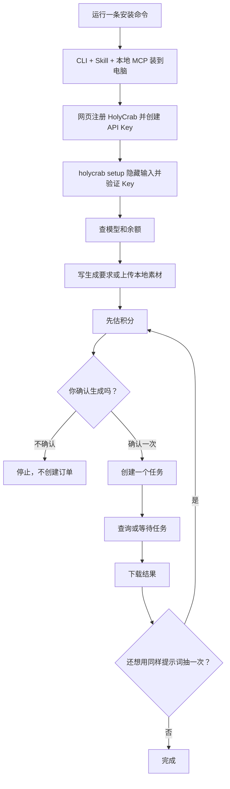

# HolyCrab CLI 使用指南

这份指南让你从一台普通 Mac、Linux 或 Windows 电脑出发，装好 HolyCrab CLI、Skill 和本地 MCP，然后完成 API Key 配置、真人授权、素材上传、估价、生成和下载。

整套工具直接使用 HolyCrab 现有正式服务，不需要等待新 OAuth 或新 MCP 后端上线。



## 1. 安装

支持 macOS、Linux 和 Windows，需要 Python 3.10+；macOS/Linux 还需要 `curl`。使用对应系统的官方稳定入口。

这些官方命令始终安装最新正式版。只有通过发布验证并上传安装器的稳定版本才会更新入口；Draft 和预发布版本不会进入普通用户的安装流程。内部测试人员仍应使用下面的仓库源码安装方式。

macOS / Linux：

```bash
curl -fsSL https://holycrab.ai/cli/install.sh | sh && export PATH="$HOME/.local/bin:$PATH"
```

Windows PowerShell：

```powershell
irm https://holycrab.ai/cli/install.ps1 | iex
```

当前仓库尚未发布时，可以在仓库目录里测试完全相同的安装过程：

```bash
HOLYCRAB_INSTALL_SOURCE_DIR="$PWD" sh install.sh
```

安装器会完成三件事：

1. 安装 `holycrab` 命令。
2. 给 Codex 和 Claude Code 安装 HolyCrab Skill。
3. 检测到 Codex 或 Claude Code 时，登记本地 `holycrab mcp serve`。

它不会要求 sudo，也不会在安装阶段索要 API Key。

macOS/Linux 安装器会把 `~/.local/bin` 保存到 zsh、bash 或 POSIX shell 的启动配置。当前终端仍找不到 `holycrab` 时运行：

```bash
export PATH="$HOME/.local/bin:$PATH"
```

PowerShell 安装器会同时更新当前会话和用户级 PATH。如果看到 `sh is not recognized`，说明误用了 macOS/Linux 命令；请改用上面的 `irm ... install.ps1 | iex`。缺少 Python 时，按安装器提示运行 `winget install --id Python.Python.3.12 -e`，然后重新安装 HolyCrab。

然后自检：

```bash
holycrab doctor --json
```

看到 `"ok": true` 就说明本地文件齐了。`checks.config.keyConfigured` 为 `false` 很正常，因为还没配置 API Key。需要连网复核版本、Key 和 MCP 登记时运行 `holycrab doctor --json --online`。

覆盖安装或升级时直接重新运行安装命令，不需要先卸载；本机保存的 Key 和任务记录不会被安装器删除。完整卸载命令见仓库 README。

## 2. 注册并配置 API Key

1. 打开 [HolyCrab API Key 页面](https://generate.holycrab.ai/user-tokens)。
2. 没有账号就先注册、登录。
3. 创建或复制一个 API Key。建议给这个 Key 设置合理的积分额度。
4. 回到终端运行：

```bash
holycrab setup
```

终端会隐藏你粘贴的内容。CLI 验证成功后，把 Key 保存在本机。也可以用含义更明确的 `holycrab auth set-key` 完成相同操作：

```text
~/.config/holycrab/config.json
```

macOS/Linux 上这个文件只有当前电脑用户可读写；Windows 使用当前 Windows 用户的 DPAPI 加密，旧版明文会在首次读取后自动迁移。不要把 Key 发到聊天里，也不要写进提示词。

如果终端原来设置过 `HOLYCRAB_API_KEY`，它会优先于刚保存的 Key。CLI 会显示提醒；运行下面这条命令即可切回本地配置：

```bash
unset HOLYCRAB_API_KEY
```

检查 Key 状态和余额：

```bash
holycrab auth status
holycrab credits balance
```

## 3. 看看能生成什么

```bash
holycrab models list
holycrab models show dreamina-seedance-2-5-260628
holycrab models show MiniMax-H3
```

先查再用，不要凭记忆猜时长、清晰度或素材数量。CLI 和 MCP 读取随本版本发布的公开能力快照，并在 JSON 结果中标明快照版本；`v0.4.1` 的模型快照版本为 `2026-09-14`。`estimate` 和 `create` 共用同一套本地校验，已知非法组合不会发到服务端。

## 4. 第一次生成图片

先估积分，不创建任务：

```bash
holycrab generate estimate --kind image \
  --json '{"prompt":"A tiny red crab reading beside a rainy window","model":"seedream-5-0-lite-260128","size":"2k"}'
```

确认模型、尺寸和积分后，运行创建命令：

```bash
holycrab generate create --kind image \
  --json '{"prompt":"A tiny red crab reading beside a rainy window","model":"seedream-5-0-lite-260128","size":"2k"}'
```

CLI 会再显示估算并问：

```text
Create one billable task with this request? [y/N]
```

输入 `y` 才会创建一个付费任务。记下返回的 `taskId`。

自动化脚本可以使用 `--yes`，但只能在用户已经明确确认后使用：

```bash
holycrab generate create --kind image --yes \
  --json '@/absolute/path/image-request.json'
```

## 5. 生成视频或音频

Seedance 2.5 视频估算示例：

```bash
holycrab generate estimate --kind video \
  --json '{"model":"dreamina-seedance-2-5-260628","prompt":"A paper boat crosses a neon puddle","duration":8,"resolution":"720p","ratio":"16:9","videoTaskType":"reference"}'
```

Seedance 视频默认生成伴随音频。要生成静音视频，请在 JSON 中加入 `"generateAudio": false`。MiniMax H3 不支持自动生成音频，CLI 不会给 H3 添加这个字段。

MiniMax H3 视频估算示例：

```bash
holycrab generate estimate --kind video \
  --json '{"model":"MiniMax-H3","prompt":"Morning fog moves through a pine forest","duration":5,"resolution":"768P","ratio":"16:9"}'
```

音频估算示例：

```bash
holycrab generate estimate --kind audio \
  --json '{"textPrompt":"A calm narrator welcomes the listener.","audioConfig":{"format":"mp3","sample_rate":24000}}'
```

把 `estimate` 换成 `create` 后仍会先询问确认。

## 6. 使用本地素材

```bash
holycrab assets upload /absolute/path/reference.mp4 \
  --duration-seconds 8
```

CLI 先显示解析后的真实路径、名称、类型、大小和已知时长，再只询问一次。确认后才会按列表顺序完成预签名上传和 multipart 素材登记；不需要另外编写上传脚本。最多 10 个文件，任一文件本地校验失败时整批不会产生上传请求，确认后文件被替换或修改也会终止。

上传成功后只保留返回的素材 ID。临时上传地址不会显示在终端或 Agent 回复里。

### 真人素材：先扫码授权，再上传

本节对应 `v0.4.1`。线上需要配套 API 和官方回调页；不要把单元测试通过当成真实授权通过。

固定七步：

1. 先运行 `real-human groups list`，决定复用已有分组还是新授权。
2. 新授权只创建一次，核对人物名称、有效期、私密链接和二维码。
3. 由本人在手机完成验证并点击最终确认；Agent 不能代做。
4. 始终查询同一个 `AUTHORIZATION_ID`，不因等待或断网重复创建。
5. 成功后核对人物分组名称和 `group.uniqId`，再准备上传。
6. 上传前查看目标人物和全部文件，只确认一次；授权成功本身不是上传确认。
7. 等全部素材 `ready: true` 后，把素材 ID 放进生成请求，先估积分，再另行确认付费生成。

先创建一次授权，名称用于区分人物，不要求输入证件姓名：

```bash
holycrab real-human start --name "小林"
```

返回的 `authorizationId` 用来查状态，`h5Link` 是临时授权链接，`qrPath` 是本机二维码 PNG 的绝对路径。本人打开链接或扫码，按页面提示完成验证，最后点击完成返回官方回调页。不要把链接或二维码发到公开群、公开文档或第三方二维码网站。

Agent 不能替本人刷脸。二维码保存失败时，继续使用已返回的链接，不要再创建一条授权。手机端不需要登录桌面上的 HolyCrab 网页账号来提交回调。

```bash
holycrab real-human get AUTHORIZATION_ID
holycrab real-human wait AUTHORIZATION_ID --interval 5 --timeout 600
```

状态含义：`CREATED` 等待本人操作，`SUCCEEDED` 授权成功，`FAILED` 验证失败，`EXPIRED` 会话过期。成功返回的 `group.uniqId` 就是后续上传使用的 `GROUP_ID`。等待超时返回退出码 2，保留授权 ID 后可继续查；失败或过期返回退出码 1，不会自动重新授权。

| 状态 | 含义 | 下一步 |
| --- | --- | --- |
| `CREATED` | 等本人扫码、验证并最终确认 | `holycrab real-human wait AUTHORIZATION_ID --timeout 600` |
| `SUCCEEDED` | 只代表可向该人物分组上传 | `holycrab assets upload FILE [FILE ...] --real-human-group GROUP_ID` |
| `FAILED` | 本次没有完成 | 解释原因，先问用户是否重试，再新建授权 |
| `EXPIRED` | 私密链接已过期 | 先征得同意，再新建授权 |
| wait 超时 | 只是暂时没等到 | 保留 ID，运行 `holycrab real-human get AUTHORIZATION_ID` |
| 素材处理中 | 文件已登记但尚未就绪 | `holycrab assets wait ASSET_ID [ASSET_ID ...] --timeout 600` |
| `UPLOADED_TO_ARK` / `ready: true` | 素材可以进入生成请求 | 先运行 `holycrab generate estimate ...` |
| 素材 `FAILED` | 线上处理失败 | 显示公开错误，禁止自动重传 |
| 上传结果不明确 | 不知道线上是否已登记 | 保留资产 ID/分组 ID并查询，禁止重复上传 |

已经授权过的人可以直接查列表。列表支持分页，遇到同名人物先确认分组，不要猜：

```bash
holycrab real-human groups list --page 1 --page-size 20
holycrab real-human assets list --group GROUP_ID --page 1 --page-size 50
holycrab assets upload /absolute/path/front.jpg /absolute/path/profile.mp4 --real-human-group GROUP_ID
holycrab assets get ASSET_ID
holycrab assets wait ASSET_ID [ASSET_ID ...] --timeout 600
```

`ASSET_ID` 使用上传返回的 `assetUniqId`，或列表中的 `uniqId`。真人分组支持图片和视频；上传视频时可加 `--duration-seconds 8`。省略 `--real-human-group` 会走普通素材流程，不能用来绕过真人验证。

删除不可恢复。删除人物会同时删除该组全部素材和上游人物分组；删除单个素材会清理存储、上游记录和数据库记录。命令会先显示目标并询问确认：

```bash
holycrab real-human assets delete ASSET_ID --group GROUP_ID
holycrab real-human groups delete GROUP_ID
```

脚本或 Agent 只有在用户明确要求删除该具体对象后才能加 `--yes`。MCP 的 `real_human_group_delete` 和 `real_human_asset_delete` 同样要求 `confirmed: true`。授权成功、素材上传成功或确认生成都不能替代删除确认。删除结果遇到超时、断线、5xx 或异常响应时不要再次提交，先重新查询人物或素材列表确认实际状态。

只有 `step: UPLOADED_TO_ARK`、`ready: true` 才能生成。素材返回 `FAILED` 时先看 `error`，不要自动重传。上传登记遇到连接中断、502/504 或无效响应时，保存提示里的素材 ID、分组 ID，先查单个素材或分组列表，不能把它当作“肯定没上传”。

真人素材只接受 JPG/JPEG、PNG、WEBP、GIF、HEIC、MP4、MOV；图片必须小于 30 MiB，视频不得超过 50 MiB，音频直接拒绝。尺寸、比例、帧率、2–15 秒时长及 H.264/H.265、AAC/MP3 等编码限制仍由线上处理确认；本地预检通过不是“保证可用”。批量执行遇到首个失败或结果不明确就停止，并分别列出 `uploaded`、`failedOrUnknown`、`notAttempted`。

素材就绪后，将公开 ID 放入原有视频请求，不传人物分组 ID或上游素材 ID：

```bash
holycrab generate estimate --kind video \
  --json '{"model":"dreamina-seedance-2-5-260628","prompt":"参考人物在咖啡店向镜头挥手，保持外观一致","duration":8,"resolution":"720p","ratio":"16:9","videoTaskType":"reference","imageAssetIds":["REPLACE_WITH_ASSET_ID"]}'
```

确认积分后才执行 `generate create`。真人授权成功不代表同意付费生成，重复抽卡仍需新的生成确认。

本机二维码位于 HolyCrab 配置目录的 `real-human` 子目录，文件仅当前用户可读。查到终态时清理；后续 CLI/MCP 调用会清理过期文件。程序不在后台运行，不会自动清理聊天记录中的图片；不再使用 CLI 时可手动删除遗留二维码。

## 7. 查任务、等待和下载

```bash
holycrab tasks list
holycrab tasks list --start-date 2026-09-01 --end-date 2026-09-14 --type AUDIO
holycrab tasks get TASK_ID
holycrab tasks wait TASK_ID --timeout 600
holycrab download TASK_ID --output ./result.mp4
```

日期筛选必须成对提供；列表是“当前 HolyCrab 用户下的任务”，不是“只有当前 API Key 创建的任务”。音频任务的原始 `audioIds` JSON 字符串会统一解析为 `audioUrls`，同样可用 `download` 下载。下载默认不覆盖已有文件，确实要替换时加 `--force`。

`step=2` 表示完成，`step=3` 表示失败。等待超时只代表“暂时没等到”，CLI 不会偷偷再生成一次。

## 8. 同样的提示词多抽几次

允许。每次你明确确认，都是一个新订单：

```text
第一次确认 → attempt A → task A
第二次确认 → attempt B → task B
第三次确认 → attempt C → task C
```

本地防重只阻止同一个 attempt 被网络重试两次，不会阻止你主动再抽一次。

断网、超时、HTTP 408/5xx、异常成功响应、或 2xx 没有合法任务 ID 时，attempt 会记为 `unknown`，绝不自动再次 POST：

```bash
holycrab generate attempts list
holycrab generate attempts get ATTEMPT_ID
holycrab tasks list --page 1 --page-size 20
```

最近任务里查不到，也不能证明线上没有创建。换电脑、删除本地记录或绕开 CLI 时，本地防重无法提供全局绝对保证。

## 9. 在 Codex 或 Claude Code 里使用

检查 MCP 是否已经登记：

```bash
codex mcp get holycrab
claude mcp get holycrab
```

然后可以直接对 Agent 说：

```text
用 HolyCrab 查一下现在的视频模型。我要做 8 秒、16:9 的雨夜街景，先给我模型建议和积分估算，不要直接生成。
```

Agent 应该按这个顺序工作：查能力 → 组参数 → 估积分 → 等你确认 → 为这次抽卡创建一个稳定 attempt ID → 提交一次 → 返回任务 ID → 查结果。网络重试必须沿用同一个 ID；你明确再抽一次时才换新 ID。

真人场景可以这样说：

```text
用 HolyCrab 帮我发起“小林”的真人授权，给我链接和二维码。我完成后再把我指定的照片上传到该人物分组，等素材处理成功后估算一个 8 秒视频的积分，先不要生成。
```

MCP 发起工具会返回二维码图片和临时链接；Agent 用短查询检查授权与素材，不会长期阻塞整个 MCP 服务。若当前客户端不能展示图片，仍可使用链接或本机 `qrPath`。

## 10. 更新与启动自检

每次启动会检查 Python 3.10+、CLI/能力清单/Skill/二维码依赖、安装清单、配置与 attempt 是否可安全读取；提示写入 stderr，不污染 JSON 或 MCP stdout。联网版本检查每 24 小时最多一次、正常命令最多等待 2 秒，失败不影响业务命令，也不会静默更新。

```bash
holycrab update --check
holycrab update
holycrab update --yes
```

只接受版本更高、非 Draft、非 prerelease 的严格语义版本。更新器校验 GitHub Release 的 SHA-256 `digest`，安装器再校验内部文件；更新后的 `doctor` 不通过会恢复旧托管文件和原配置。`v0.4.0` 用户需要最后手动安装一次 `v0.4.1`。受管或离线环境可设置 `HOLYCRAB_NO_UPDATE_CHECK=1`。

## 11. 安全卸载

交互式卸载会先显示程序、MCP、Skill、PATH 和本地数据的处理方式，只询问一次：

```text
holycrab uninstall
holycrab uninstall --yes
holycrab uninstall --purge
holycrab uninstall --purge --yes
```

默认模式只移除当前安装器管理的 CLI、真实命令仍指向当前安装位置的 MCP 登记，以及没有被修改的 Skill 文件。API Key、attempt、上传计划和真人授权临时记录保留在本机，重新安装后可以继续使用。脚本环境只有在用户已经看过完整预览并明确同意时才能加 `--yes`。

`--purge` 会清理 HolyCrab 已知的本地凭据和记录，但不会调用 HolyCrab API，也不会删除云端任务、素材或授权。需要让 API Key 彻底失效时，仍须前往 [API Key 页面](https://generate.holycrab.ai/user-tokens)撤销。修改过的 Skill、额外文件、其他 MCP 和共享 `.local/bin` 中的其他程序不会删除；旧安装缺少 PATH 所有权记录时，命令会保留 PATH 并显示人工处理提示。

卸载是本机用户操作，不提供 MCP 工具。Agent 必须先用用户当前语言说明默认卸载与 `--purge` 的区别，并获得对应模式的明确授权。

## 12. 常见问题

`holycrab: command not found`

```bash
export PATH="$HOME/.local/bin:$PATH"
```

Key 验证失败：如果输出显示 `"credentialSource": "environment"`，先运行 `unset HOLYCRAB_API_KEY`，再运行 `holycrab setup`；否则回到网页确认 Key 仍然启用。

网络中断：先运行 `holycrab tasks list` 查看最近任务。不要立刻重复相同 attempt；如果你明确想重新抽一次，再发起一个新创建命令。

清除本机保存的 Key：

```bash
holycrab auth clear-key
```

这只删除本机保存的 Key。需要彻底撤销时，还要去 HolyCrab 网页禁用该 Key。

## 13. 隐私、条款与支持

HolyCrab CLI 不额外收集遥测数据；服务使用遵循 HolyCrab 隐私政策和服务条款。

- [Privacy Policy](https://holycrab.ai/privacy/)
- [Terms of Service](https://holycrab.ai/terms/)
- 普通使用问题：`cs@holycrab.ai`
